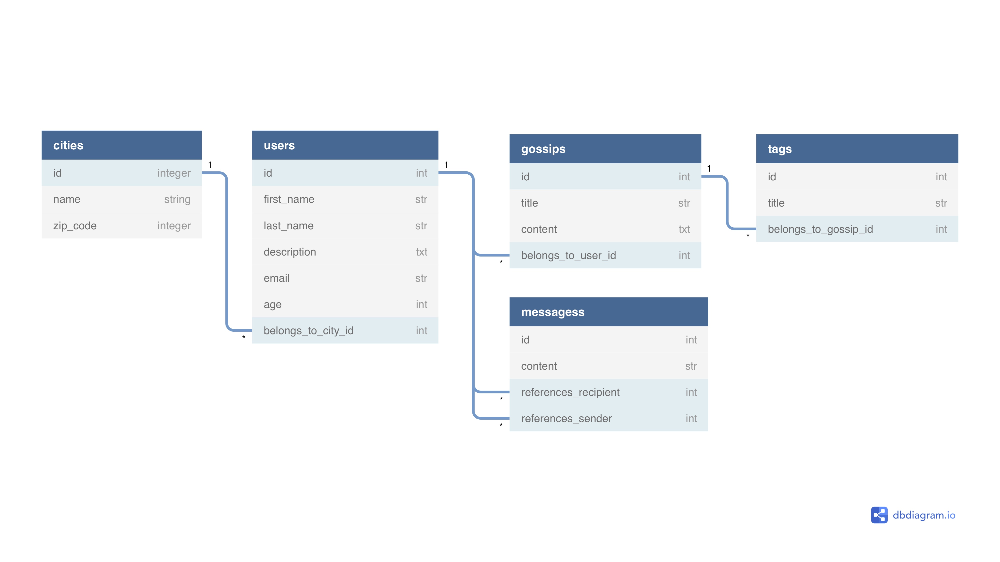

# README

Creation des models: 

	User, City, Gossip, Tag & PrivateMessage

Avec les relations:

	Un utilisateur appartient à une seule ville mais une ville peut contenir plusieurs utilisateurs. 
	Un utilisateur peut écrire plusieurs gossips mais un gossip ne peut être écrit que par un seul utilisateur. 
	Un gossip peut avoir plusieurs tags et un tag peut être présent sur plusieurs gossip.
	Un PM aura un expéditeur et un (ou plusieurs) destinataires.

Creation d'un seeds.rb
